<p align="center">
  
</p>

<p align="center">
  <a href="https://badge.fury.io/py/rustfuzz"></a>
  <a href="https://bmsuisse.github.io/rustfuzz/"></a>
  <a href="https://github.com/bmsuisse/rustfuzz/actions/workflows/test.yml"></a>
  
  
  
</p>

---

> **🤖 This project was built entirely by AI.**
>
> The idea was simple: could an AI agent beat [RapidFuzz](https://github.com/maxbachmann/RapidFuzz) — one of the fastest fuzzy matching libraries in the world — by writing a Rust-backed Python library from scratch, guided only by benchmarks?
>
> The development loop was: **Research → Build → Benchmark → Repeat.**

---

**rustfuzz** is a blazing-fast fuzzy string matching library for Python — implemented entirely in **Rust**. 🚀

Zero Python overhead. Memory safe. Pre-compiled wheels for every major platform.

## The Challenge: Beat RapidFuzz

```mermaid
flowchart LR
    R["🔍 Research<br>Profiler output<br>& algorithm gaps"]
    B["🦀 Build<br>Rust implementation<br>via PyO3"]
    T["✅ Test<br>All tests must pass<br>before proceeding"]
    BM["📊 Benchmark<br>vs RapidFuzz<br>Numbers don't lie"]
    RP["🔁 Repeat<br>Find the next<br>bottleneck"]

    R --> B --> T --> BM --> RP --> R

    style R fill:#6366f1,color:#fff,stroke:none
    style B fill:#a855f7,color:#fff,stroke:none
    style T fill:#ef4444,color:#fff,stroke:none
    style BM fill:#22c55e,color:#fff,stroke:none
    style RP fill:#f59e0b,color:#fff,stroke:none
```



The goal: match or exceed RapidFuzz's throughput on `ratio`, `partial_ratio`, `token_sort_ratio`, and `process.extract` — all from Python. Each iteration starts with profiling, identifies the hottest path, and rewrites it deeper into Rust.

## Features

| | |
|---|---|
| ⚡ **Blazing Fast** | Core algorithms written in Rust — no Python overhead, no GIL bottlenecks |
| 🧠 **Smart Matching** | Ratio, partial ratio, token sort/set, Levenshtein, Jaro-Winkler, and more |
| 🔒 **Memory Safe** | Rust's borrow checker guarantees — no segfaults, no buffer overflows |
| 🐍 **Pythonic API** | Clean, typed Python interface. Import and go |
| 📦 **Zero Build Step** | Pre-compiled wheels on PyPI for Python 3.10–3.13 on all major platforms |
| 🏔️ **Big Data Ready** | Excels in 1 Billion Row Challenge benchmarks, crushing high-throughput tasks |
| 🧩 **Ecosystem Integrations** | BM25, Hybrid Search, and LangChain Retrievers for Vector DBs (Qdrant, LanceDB, FAISS, etc.) |

## Installation

```sh
pip install rustfuzz
# or, with uv (recommended — much faster):
uv pip install rustfuzz
```

## Quick Start

```python
import rustfuzz.fuzz as fuzz
from rustfuzz.distance import Levenshtein

# Fuzzy ratio
print(fuzz.ratio("hello world", "hello wrold"))          # ~96.0

# Partial ratio (substring match)
print(fuzz.partial_ratio("hello", "say hello world"))    # 100.0

# Token-order-insensitive match
print(fuzz.token_sort_ratio("fuzzy wuzzy", "wuzzy fuzzy")) # 100.0

# Levenshtein distance
print(Levenshtein.distance("kitten", "sitting"))         # 3

# Normalised similarity [0.0 – 1.0]
print(Levenshtein.normalized_similarity("kitten", "kitten")) # 1.0
```

### Batch extraction

```python
from rustfuzz import process

choices = ["New York", "New Orleans", "Newark", "Los Angeles"]
print(process.extractOne("new york", choices))
# ('New York', 100.0, 0)

print(process.extract("new", choices, limit=3))
# [('Newark', ...), ('New York', ...), ('New Orleans', ...)]
```

## Supported Algorithms

| Module | Algorithms |
|--------|------------|
| `rustfuzz.fuzz` | `ratio`, `partial_ratio`, `token_sort_ratio`, `token_set_ratio`, `token_ratio`, `WRatio`, `QRatio`, `partial_token_*` |
| `rustfuzz.distance` | `Levenshtein`, `Hamming`, `Indel`, `Jaro`, `JaroWinkler`, `LCSseq`, `OSA`, `DamerauLevenshtein`, `Prefix`, `Postfix` |
| `rustfuzz.process` | `extract`, `extractOne`, `extract_iter`, `cdist` |
| `rustfuzz.utils` | `default_process` |

## Documentation

Full cookbook with interactive examples and benchmark results:
👉 **[bmsuisse.github.io/rustfuzz](https://bmsuisse.github.io/rustfuzz/)**

## License

MIT © [BM Suisse](https://github.com/bmsuisse)
